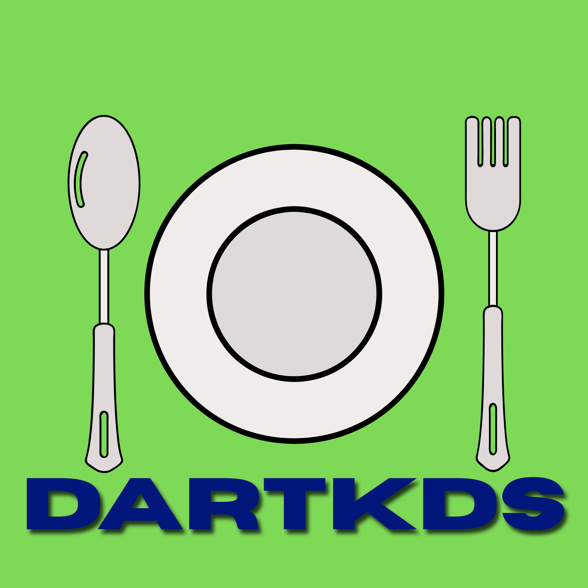
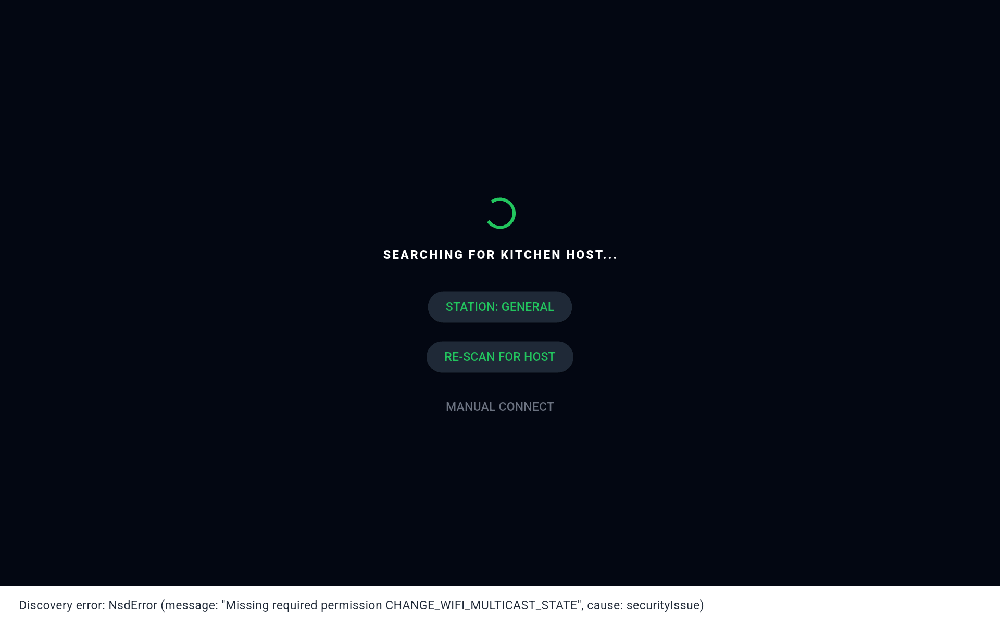

# DartKDS
### The Open Source, Offline Kitchen Display System



DartKDS is a lightweight, self-hosted **Kitchen Display System (KDS)** designed for restaurants, food trucks, and pop-up kitchens. It replaces messy paper tickets with real-time digital screens that work entirely over your local network.

**No cloud. No subscriptions. No internet required.**

---

## 📸 Screenshots

| Order Intake (Host) | Kitchen Display (Client) |
| :---: | :---: |
|  |  |
| *Modern, intuitive order entry* | *High-contrast, actionable prep lists* |

---

## ✨ Key Features

- 📱 **Flexible Roles** — Turn any tablet or phone into a Primary Host (Intake) or a Kitchen Display (Client).
- 🔌 **Instant Pairing** — Connect new screens in seconds via **QR Code Scanning**.
- 🟦 **Square POS Integration** — Feed orders directly from Square into your kitchen screens via built-in webhooks.
- 🔍 **Smart Routing** — Orders automatically route to specific stations (Grill, Fryer, Bar, etc.) based on your menu configuration.
- 📊 **Insightful Analytics** — Track item popularity and modifier frequency (e.g., "Which burger toppings are trending?").
- 🌐 **Browser Support** — Access the kitchen view from any device with a web browser.
- 💾 **Local Resilience** — Orders are stored on-device using a high-performance SQLite database.
- 🌓 **Adaptive UI** — Light mode for Front-of-House and a high-contrast Dark Mode for the Kitchen.
- 🔋 **Keep Screen On** — Prevent the host display from sleeping during service (optional).
- 🔔 **Kitchen Broadcasts** — Push alerts (86s, rush notices, etc.) straight to station screens.

---

## 🚀 Getting Started

### 1. The Host (Front-of-House)
Launch DartKDS on your main tablet and select **Primary Host**. This device becomes the "brain" of your kitchen, hosting the database and the server.

### 2. The Clients (Kitchen Stations)
Launch the app on other devices and select **Client**. 
- **Easy Pairing:** Tap "Scan QR Code" on the client and point it at the Host's pairing code in Settings.
- **Auto-Discovery:** Clients will automatically find the Host if they are on the same Wi-Fi network.

### 3. External Orders (Optional)
Connect your **Square POS** to the Host's webhook endpoint (`/api/webhooks/square`) to sync sales automatically.

---

## 🛠 Developer Setup

If you want to build or customize DartKDS:

### Prerequisites
- [Flutter SDK](https://docs.flutter.dev/get-started/install)
- Python 3 (optional, for automation)

### Installation
```bash
git clone https://github.com/CephandriusMaxtori/dartKDS.git
cd dartKDS
flutter pub get
dart run build_runner build --delete-conflicting-outputs
```

### Building for Android
We've included a helper script that builds the Web UI bundle and produces per-ABI release APKs:
```bash
python build.py            # full release build (web UI + all ABI APKs)
python build.py --apk-only # APK-only if the Web UI is already bundled
# or run the steps manually:
#   flutter build web --no-web-resources-cdn
#   dart run scripts/bundle_webui.dart
#   flutter build apk --release --split-per-abi
```

---

## 🧩 Project Architecture

- **State Management:** Riverpod
- **Database:** Drift (SQLite)
- **Networking:** Shelf (Embedded Server) + WebSockets (Real-time Sync)
- **Discovery:** mDNS + UDP Broadcast

---

## 🤝 Contributing
Found a bug or want to add a feature? 
1. Open an issue to discuss your ideas.
2. Submit a PR with your changes.

**DartKDS** — *Built for speed, built for reliability, built for the kitchen.*
